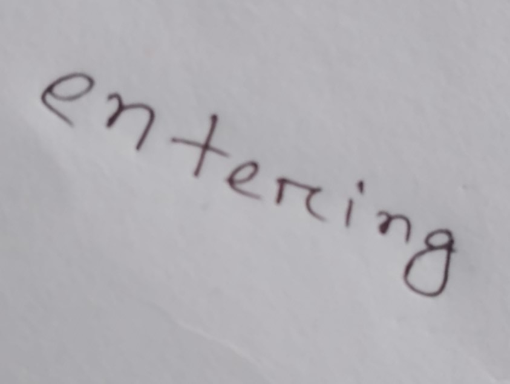
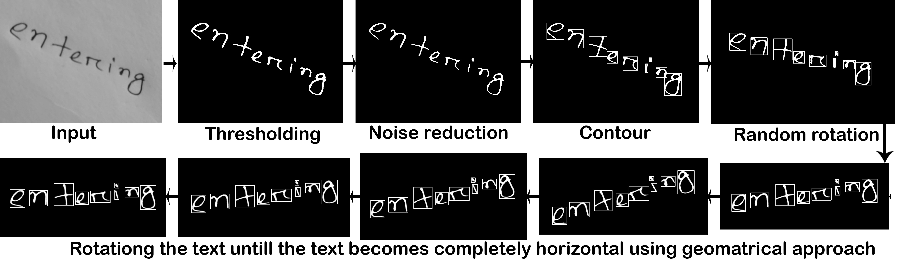

# Hand Writing Recognition
In this project hand written words are recognized form image given. Used machine learning and image processing, to be specific Tensorflow and Opencv. Single word image can be taken as input and the output will be plain text. The word in the image can be in any inclination or with minimal noise, the image processing part will recreate the image correctly and then send the image to recognize. The accuracy of the learning processing came out as: 95.5%. A little expansion of code can be done to let it recognize a whole sentence or sentences, because the words are not recognized at a whole, the letters are divided form the word first the letters are recognized. In this code if a sentence is given, then it will be able to recognize the whole sentence except the gaps between the words and punctuation marks.
## Input ##

## Processign Steps ##

## Processing outputs ##

## Model ##
A custom model has been used. The model for this training is attached with this project as "model7".
